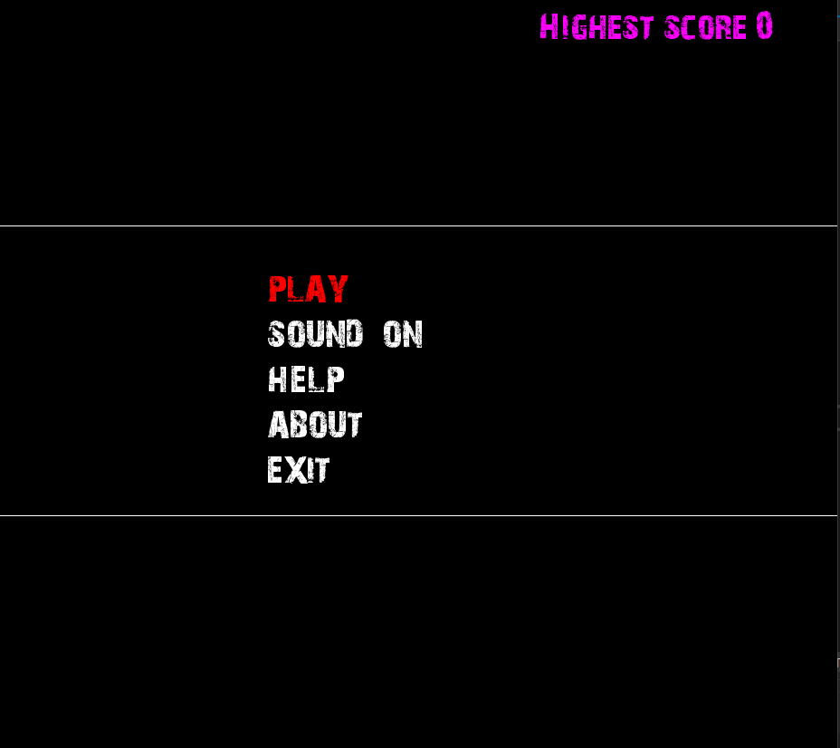
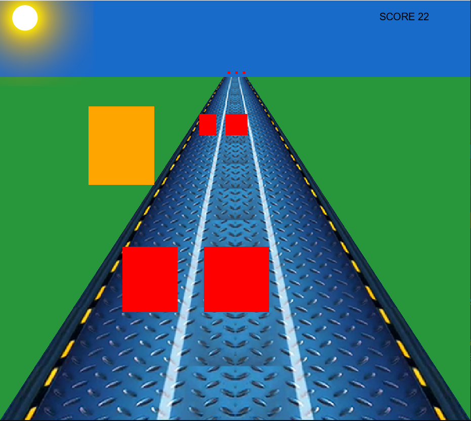

# c_game_project
A runner game project that is developed for Algorithm and Programming Lecture by using Allegro 5 game development library

## Development

Since Allegro is a 2D game library, and my project is making a 3D game, I had some many limitations because I could just draw 2D graphics. After a while, I decided to use perspective drawing to make 3D-like game. It means that, if an object gets closer to the player (or screen) it should get bigger. By using this technique, I created a 3d-like game.

## The Game

The purpose of this game is collecting golds without hitting red blocks. You can play by using arrow keys to move player, and space key to jump

 
 
 
 

## Screenshot

## Menu

## Game

